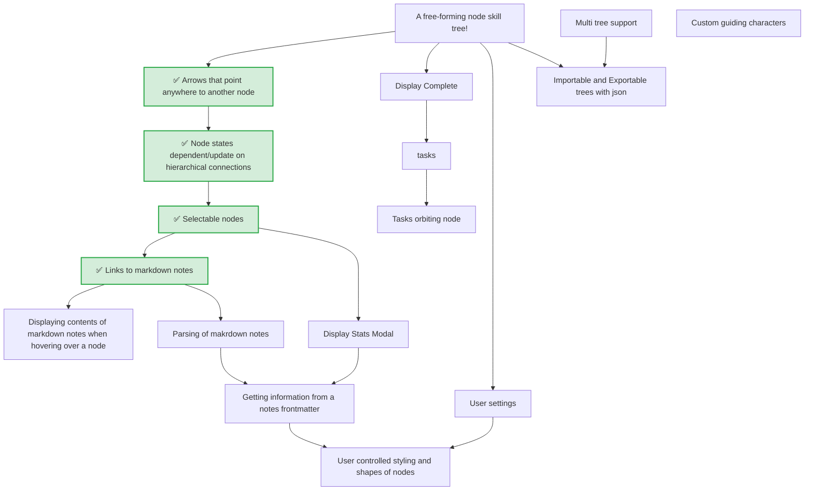

This is a work in progress.

  

<h1>A SKILL TREE FOR WHATEVER YOU NEED IN LIFE
</h1>

This is a vibe-coded project. I will comb through it on my own time, but I really don't much like Type/Javascript, therefore I am taking the easy approach.

<h2>USAGE</h2>

  

### Key Ideas:

* A designable tree that you yourself can link with your notes and [tasks](https://github.com/obsidian-tasks-group/obsidian-tasks)
* An exp level gamify the experience and to help you keep track of what you have already accomplished!

  

### Road Map:

